# springsecurity-oauth2

[OAuth](https://oauth.net/2/)是一种用来规范令牌（Token）发放的授权机制，主要包含了四种授权模式：授权码模式、简化模式、密码模式和客户端模式。Spring Security OAuth2对这四种授权模式进行了实现。这节主要记录下什么是OAuth2以及Spring Security OAuth2的基本使用。

## 四种授权模式

在了解这四种授权模式之前，我们需要先学习一些和OAuth相关的名词。举个社交登录的例子吧，比如在浏览器上使用QQ账号登录虎牙直播，这个过程可以提取出以下几个名词：

1. **Third-party application** 第三方应用程序，比如这里的虎牙直播；
2. **HTTP service** HTTP服务提供商，比如这里的QQ（腾讯）;
3. **Resource Owner** 资源所有者，就是QQ的所有人，你；
4. **User Agent** 用户代理，这里指浏览器；
5. **Authorization server** 认证服务器，这里指QQ提供的第三方登录服务；
6. **Resource server** 资源服务器，这里指虎牙直播提供的服务，比如高清直播，弹幕发送等（需要认证后才能使用）。

认证服务器和资源服务器可以在同一台服务器上，比如前后端分离的服务后台，它即供认证服务（认证服务器，提供令牌），客户端通过令牌来从后台获取服务（资源服务器）；它们也可以不在同一台服务器上，比如上面第三方登录的例子。

大致了解了这几个名词后，我们开始了解四种授权模式。

### 授权码模式

A. 客户端将用户导向认证服务器；

B. 用户决定是否给客户端授权；

C. 同意授权后，认证服务器将用户导向客户端提供的URL，并附上授权码；

D. 客户端通过重定向URL和授权码到认证服务器换取令牌；

E. 校验无误后发放令牌。

其中A步骤，客户端申请认证的URI，包含以下参数：

1. response_type：表示授权类型，必选项，此处的值固定为”code”，标识授权码模式
2. client_id：表示客户端的ID，必选项
3. redirect_uri：表示重定向URI，可选项
4. scope：表示申请的权限范围，可选项
5. state：表示客户端的当前状态，可以指定任意值，认证服务器会原封不动地返回这个值。

D步骤中，客户端向认证服务器申请令牌的HTTP请求，包含以下参数：

1. grant_type：表示使用的授权模式，必选项，此处的值固定为”authorization_code”。
2. code：表示上一步获得的授权码，必选项。
3. redirect_uri：表示重定向URI，必选项，且必须与A步骤中的该参数值保持一致。
4. client_id：表示客户端ID，必选项。

### 密码模式

在密码模式中，用户像客户端提供用户名和密码，客户端通过用户名和密码到认证服务器获取令牌。

A. 用户向客户端提供用户名和密码；

B. 客户端向认证服务器换取令牌；

C. 发放令牌。

B步骤中，客户端发出的HTTP请求，包含以下参数：

1. grant_type：表示授权类型，此处的值固定为”password”，必选项。
2. username：表示用户名，必选项。
3. password：表示用户的密码，必选项。
4. scope：表示权限范围，可选项。

## Spring Security OAuth2

Spring框架对OAuth2协议进行了实现，下面学习下上面两种模式在Spring Security OAuth2相关框架的使用。

Spring Security OAuth2主要包含认证服务器和资源服务器这两大块的实现：


认证服务器主要包含了四种授权模式的实现和Token的生成与存储，我们也可以在认证服务器中自定义获取Token的方式（后面会介绍到）；资源服务器主要是在Spring Security的过滤器链上加了OAuth2AuthenticationProcessingFilter过滤器，即使用OAuth2协议发放令牌认证的方式来保护我们的资源。

### 配置认证服务器

新建一个Spring Boot项目，版本为2.2.6.RELEASE，并引入相关依赖，pom如下所示：

```java
<?xml version="1.0" encoding="UTF-8"?>
<project xmlns="http://maven.apache.org/POM/4.0.0"
         xmlns:xsi="http://www.w3.org/2001/XMLSchema-instance"
         xsi:schemaLocation="http://maven.apache.org/POM/4.0.0 http://maven.apache.org/xsd/maven-4.0.0.xsd">
    <modelVersion>4.0.0</modelVersion>

    <parent>
        <groupId>org.springframework.boot</groupId>
        <artifactId>spring-boot-starter-parent</artifactId>
        <version>2.2.6.RELEASE</version>
        <relativePath/> <!-- lookup parent from repository -->
    </parent>

    <groupId>com.study.sso</groupId>
    <artifactId>springsecurity-oauth2</artifactId>
    <version>1.0-SNAPSHOT</version>

    <properties>
        <java.version>1.8</java.version>
        <spring-cloud.version>Greenwich.SR1</spring-cloud.version>
    </properties>

    <dependencies>
        <dependency>
            <groupId>org.springframework.boot</groupId>
            <artifactId>spring-boot-starter-web</artifactId>
        </dependency>
        <dependency>
            <groupId>org.springframework.cloud</groupId>
            <artifactId>spring-cloud-starter</artifactId>
        </dependency>
        <dependency>
            <groupId>org.springframework.cloud</groupId>
            <artifactId>spring-cloud-starter-oauth2</artifactId>
        </dependency>
        <dependency>
            <groupId>org.springframework.cloud</groupId>
            <artifactId>spring-cloud-starter-security</artifactId>
        </dependency>
        <dependency>
            <groupId>org.apache.commons</groupId>
            <artifactId>commons-lang3</artifactId>
        </dependency>
        <dependency>
            <groupId>org.projectlombok</groupId>
            <artifactId>lombok</artifactId>
        </dependency>
        <dependency>
            <groupId>cn.hutool</groupId>
            <artifactId>hutool-http</artifactId>
            <version>5.6.0</version>
        </dependency>

        <dependency>
            <groupId>org.springframework.boot</groupId>
            <artifactId>spring-boot-starter-test</artifactId>
            <scope>test</scope>
        </dependency>
        <dependency>
            <groupId>cn.hutool</groupId>
            <artifactId>hutool-json</artifactId>
            <version>5.6.0</version>
        </dependency>
    </dependencies>

    <dependencyManagement>
        <dependencies>
            <dependency>
                <groupId>org.springframework.cloud</groupId>
                <artifactId>spring-cloud-dependencies</artifactId>
                <version>${spring-cloud.version}</version>
                <type>pom</type>
                <scope>import</scope>
            </dependency>
        </dependencies>
    </dependencyManagement>

    <build>
        <plugins>
            <plugin>
                <groupId>org.springframework.boot</groupId>
                <artifactId>spring-boot-maven-plugin</artifactId>
            </plugin>
        </plugins>
    </build>
</project>
```

在创建认证服务器前，我们先定义一个`MyUser`对象：

```java
package com.study.sso.springsecurity.oauth2.entity;

import lombok.Data;

import java.io.Serializable;

@Data
public class MyUser implements Serializable {
    private static final long serialVersionUID = 3497935890426858541L;

    private String userName;
    private String password;
    private boolean accountNonExpired = true;
    private boolean accountNonLocked= true;
    private boolean credentialsNonExpired= true;
    private boolean enabled= true;
}
```

接着定义`UserDetailService`实现`org.springframework.security.core.userdetails.UserDetailsService`接口：

```
package com.study.sso.springsecurity.oauth2.service;


import com.study.sso.springsecurity.oauth2.entity.MyUser;
import org.springframework.beans.factory.annotation.Autowired;
import org.springframework.security.core.authority.AuthorityUtils;
import org.springframework.security.core.userdetails.User;
import org.springframework.security.core.userdetails.UserDetails;
import org.springframework.security.core.userdetails.UserDetailsService;
import org.springframework.security.core.userdetails.UsernameNotFoundException;
import org.springframework.security.crypto.password.PasswordEncoder;
import org.springframework.stereotype.Service;

@Service
public class UserDetailService implements UserDetailsService {
    @Autowired
    private PasswordEncoder passwordEncoder;

    @Override
    public UserDetails loadUserByUsername(String username) throws UsernameNotFoundException {
        MyUser user = new MyUser();
        user.setUserName(username);
        user.setPassword(this.passwordEncoder.encode("123456"));
        return new User(username, user.getPassword(), user.isEnabled(),
                user.isAccountNonExpired(), user.isCredentialsNonExpired(),
                user.isAccountNonLocked(), AuthorityUtils.commaSeparatedStringToAuthorityList("admin"));
    }
}
```

这里的逻辑是用什么账号登录都可以，但是密码必须为123456，并且拥有”admin”权限。

接下来开始创建一个认证服务器，并且在里面定义`UserDetailService`需要用到的`PasswordEncoder`。

创建认证服务器很简单，只需要在Spring Security的配置类上使用`@EnableAuthorizationServer`注解标注即可。创建`AuthorizationServerConfig`，代码如下所示：

```java
package com.study.sso.springsecurity.oauth2.config;

import org.springframework.context.annotation.Bean;
import org.springframework.context.annotation.Configuration;
import org.springframework.security.config.annotation.web.configuration.WebSecurityConfigurerAdapter;
import org.springframework.security.crypto.bcrypt.BCryptPasswordEncoder;
import org.springframework.security.crypto.password.PasswordEncoder;
import org.springframework.security.oauth2.config.annotation.web.configuration.EnableAuthorizationServer;

@Configuration
@EnableAuthorizationServer
public class AuthorizationServerConfig extends WebSecurityConfigurerAdapter {

    @Bean
    public PasswordEncoder passwordEncoder() {
        return new BCryptPasswordEncoder();
    }
}
```

这时候启动项目，会发现控制台打印出了随机分配的client-id和client-secret：

```
security.oauth2.client.client-id = aa726c7e-c728-45e5-9438-f3cba2cf90e2
security.oauth2.client.client-secret = 5a92b72e-7949-4c5b-9617-20cd9b261d50
```

为了方便后面的测试，我们可以手动指定这两个值。在Spring Boot配置文件application.yml中添加如下配置:

```java
security:
  oauth2:
    client:
      client-id: test
      client-secret: test
      registered-redirect-uri: http://client1.com
```

重启项目，发现控制台输出：

```
security.oauth2.client.client-id = test
security.oauth2.client.client-secret = ****
```

说明替换成功。

### 授权码模式获取令牌

接下来开始往认证服务器请求授权码。打开浏览器，访问<http://localhost:8080/oauth/authorize?response_type=code&client_id=test&redirect_uri=http://client1.com&scope=all&state=hello>

URL中的几个参数在上面的授权码模式的A步骤里都有详细说明。

这里response_type必须为code，表示授权码模式，

client_id就是刚刚在配置文件中手动指定的test，

redirect_uri这里随便指定一个地址即可，

主要是用来重定向获取授权码的，

scope指定为all，表示所有权限。

访问这个链接后，页面如下所示：

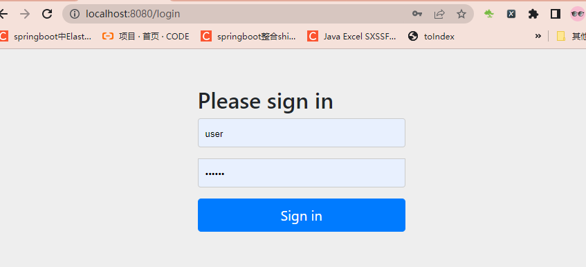

需要登录认证，根据我们前面定义的`UserDetailService`逻辑，这里用户名随便输，密码为123456即可。输入后，页面跳转如下所示：

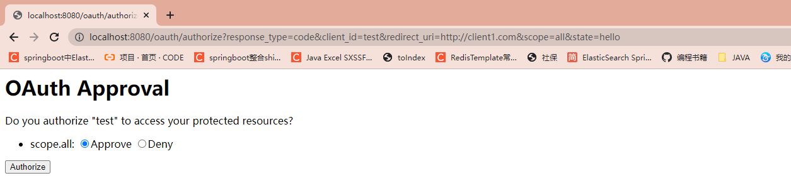

选择同意Approve，然后点击Authorize按钮后，页面跳转到了我们指定的redirect_uri，并且带上了授权码信息:


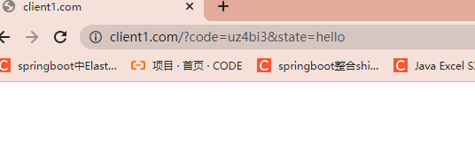


可以编写测试类或者Postman都可以，我这里采用的是使用测试类：

```java
package com.study.sso.springsecurity.oauth2;

import cn.hutool.core.util.CharsetUtil;
import cn.hutool.http.HttpRequest;
import cn.hutool.http.HttpResponse;
import cn.hutool.http.HttpUtil;
import cn.hutool.json.JSON;
import cn.hutool.json.JSONObject;
import cn.hutool.json.JSONUtil;
import lombok.Data;
import lombok.extern.slf4j.Slf4j;
import org.junit.jupiter.api.Test;
import org.junit.runner.RunWith;
import org.springframework.boot.test.context.SpringBootTest;
import org.springframework.test.context.junit4.SpringRunner;

import java.util.Calendar;
import java.util.HashMap;
import java.util.Map;

@RunWith(SpringRunner.class)
@SpringBootTest
 class TestController {

    @Test
    void contextLoads() {
        String url="http://localhost:8080/oauth/token";

        String authorization = HttpUtil.buildBasicAuth("test", "test", CharsetUtil.CHARSET_UTF_8);
        HashMap<String, String> headers = new HashMap<>();//存放请求头，可以存放多个请求头
        headers.put("Authorization", authorization);

        Map<String, Object> map = new HashMap<>();
        map.put("grant_type","authorization_code");
        map.put("code","5wLCxf");
        map.put("client_id","test");
        map.put("redirect_uri","http://client1.com");
        map.put("scope","all");

        String body = HttpUtil.createPost(url).addHeaders(headers).form(map).execute().body();
        Auth auth = JSONUtil.toBean(body, Auth.class);
        System.out.println(auth.toString());

    }
    @Data
    class Auth
    {
        private String access_token;
        private String token_type;
        private String refresh_token;
        private String expires_in;
        private String scope;
    }
}

```

执行成功后就显示了

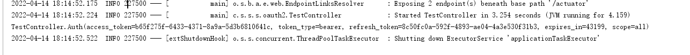

一个授权码只能换一次令牌，如果再次点击postman的发送按钮，将返回：

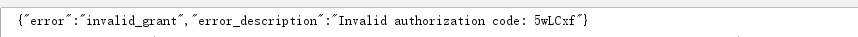

### 密码模式获取令牌

和授权码模式相比，使用密码模式获取令牌就显得简单多了。同样使用测试工具类发送POST请求

```java
@Test
void contextLoadsPassword() {
    String url="http://localhost:8080/oauth/token";

    String authorization = HttpUtil.buildBasicAuth("test", "test", CharsetUtil.CHARSET_UTF_8);
    HashMap<String, String> headers = new HashMap<>();//存放请求头，可以存放多个请求头
    headers.put("Authorization", authorization);

    Map<String, Object> map = new HashMap<>();
    map.put("grant_type","password");
    map.put("code","w38kyV");
    map.put("username","user");
    map.put("password","123456");
    map.put("scope","all");

    String body = HttpUtil.createPost(url).addHeaders(headers).form(map).execute().body();
    System.out.println(body);
    Auth auth = JSONUtil.toBean(body, Auth.class);
    System.out.println(auth.toString());

}
```

grant_type填password，表示密码模式；然后填写用户名和密码，头部也需要填写Authorization信息，内容和授权码模式介绍的一致，这里就不截图了。

点击发送，也可以获得令牌：

```
TestController.Auth(access_token=c0b0e4f8-f73a-49d5-b9d5-883a21e2d410, token_type=bearer, refresh_token=485e8976-73db-447d-98bc-d123d0f43927, expires_in=43199, scope=all)
```

### 配置资源服务器

为什么需要资源服务器呢？我们先来看下在没有定义资源服务器的时候，使用Token去获取资源时会发生什么。

```java
package com.study.sso.springsecurity.oauth2.controller;

import org.springframework.security.core.Authentication;
import org.springframework.web.bind.annotation.GetMapping;
import org.springframework.web.bind.annotation.RestController;

@RestController
public class UserController {

    @GetMapping("index")
    public Object index(Authentication authentication){
        return authentication;
    }
}
```

启动项目，为了方便我们使用密码模式获取令牌，然后使用该令牌获取`/index`这个资源：

Authorization值为`token_type access_token`，发送请求后，返回：

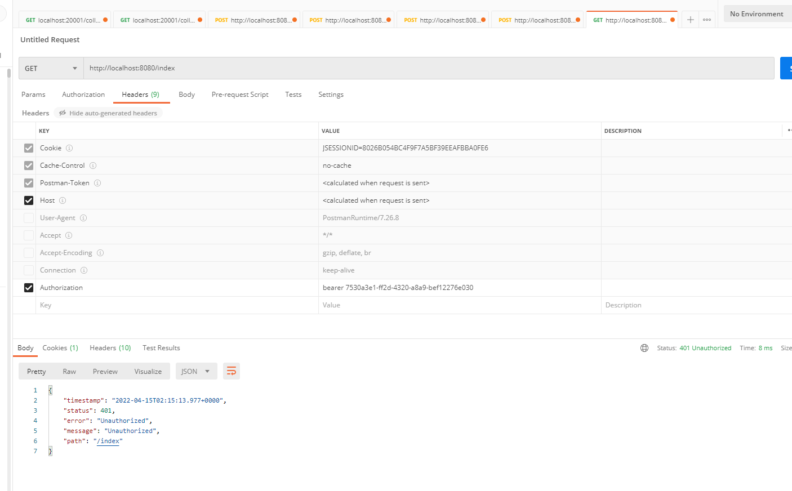

虽然令牌是正确的，但是并无法访问`/index`，所以我们必须配置资源服务器，让客户端可以通过合法的令牌来获取资源。

资源服务器的配置也很简单，只需要在配置类上使用`@EnableResourceServer`注解标注即可：

```java
package com.study.sso.springsecurity.oauth2.config;

import org.springframework.context.annotation.Configuration;
import org.springframework.security.oauth2.config.annotation.web.configuration.EnableResourceServer;

@Configuration
@EnableResourceServer
public class ResourceServerConfig  {

}
```

重启服务，重复上面的步骤，再次访问http://localhost:8080/oauth/authorize?response_type=code&client_id=test&redirect_uri=http://client1.com&scope=all&state=hello 地址获取token，会出现这个问题

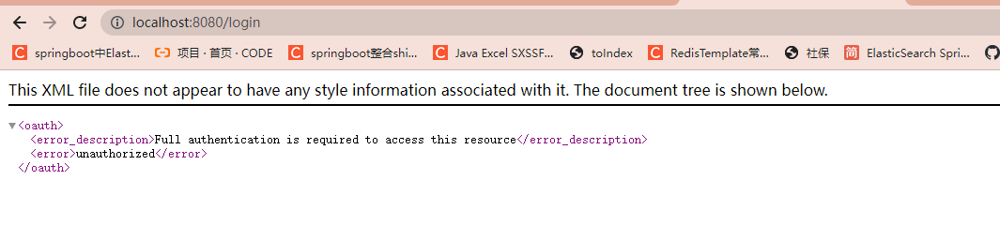

这个是由于在同时定义了认证服务器和资源服务器后，再去使用授权码模式获取令牌有可能遇到的问题，这时候只要确保认证服务器先于资源服务器配置即可，比如在认证服务器的配置类上使用`@Order(1)`标注，在资源服务器的配置类上使用`@Order(2)`标注。 注意Order后，它的加载顺序是有问题的，所以有可能出现401，最好不要加，我加上后，上方错误不出现了，但是一直401，所以我又去掉了

接下来我们再次重启服务，重复上面的步骤，访问http://localhost:8080/oauth/authorize?response_type=code&client_id=test&redirect_uri=http://client1.com&scope=all&state=hello 地址获取token

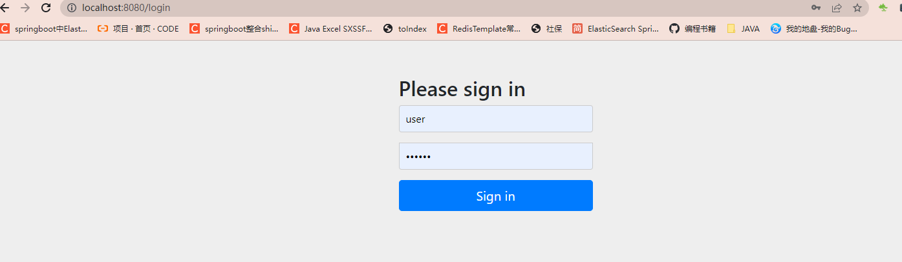

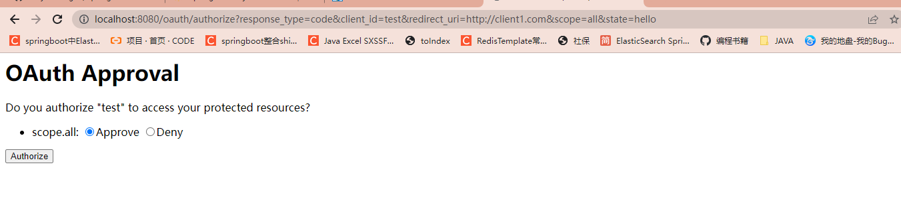

授权完成后，获取code码，

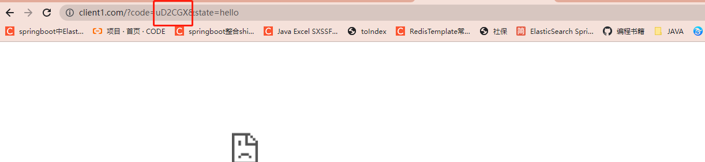

通过code码再去获取access_token和token_type

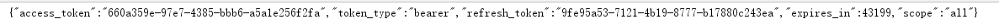

然后接着去访问http://localhost:8080/index 就可以拿到信息了

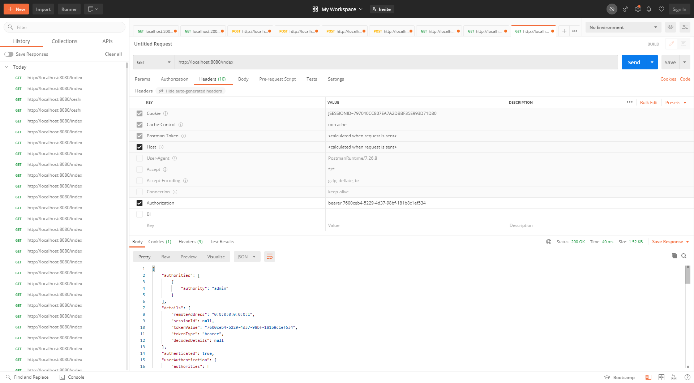